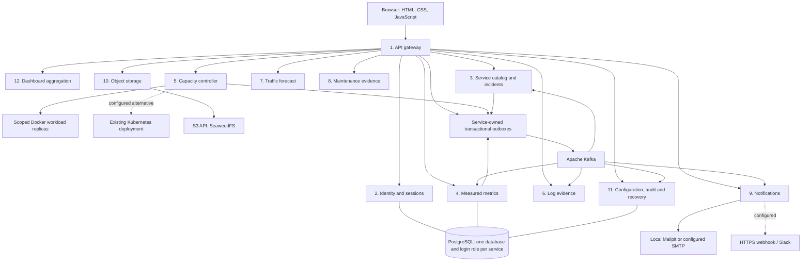

# Architecture and service boundaries

Every application service has its own PostgreSQL database, including services omitted from the diagram's database lines to keep it readable. Application containers receive only their own database password. Database roles are denied access to the other service databases. A common PostgreSQL server still represents a shared availability boundary.

## Services and owned records

| Container | Main responsibility | Owned records |
|---|---|---|
| gateway | Browser API routing, cookie/bearer verification through identity, CSRF/role checks, bounded request forwarding, process/request telemetry | Gateway outbox, inbox and operational metadata |
| auth | Accounts, password hashes, sessions, MFA and access policy | Users, email index, sessions, login attempts, security policy |
| catalog | Registration, service summaries, alert rules and incident transitions | Services, latest signals, breach counts, incidents, incident timeline |
| metrics | Request aggregation, authenticated metric ingestion, queries and source timestamps | Requests, metric observations, collector status |
| capacity | Docker/Kubernetes adapter, load jobs, scaling and reconciliation | Desired replicas, autoscale policy, scaling history, workload jobs |
| logs | Request/agent logs and evidence-linked diagnostic rules | Redacted logs, diagnostic reports |
| forecast | Chronological model selection/evaluation and projections | Latest evaluation per service |
| maintenance | Health-feature sampling and observed failure labels | Observations and label evidence |
| notifications | Inbox and independent delivery retry | Deduplicated notices and attempt state |
| storage | S3 encrypted bytes, application versions and retention | Object metadata; actual bytes and encrypted archives are in S3 |
| configuration | Thresholds, rates, audit, snapshot coordination and restoration | Workspace settings, audit events, backup catalog, recovery failure record |
| dashboard | Aggregated overview, topology, cost and failed-event views | Service outbox/inbox metadata; reads other domains only through their APIs |

## Request path

1. The browser connects only to the gateway's loopback-published port.
2. The gateway asks `auth` to check the session, current role, expiry, CSRF token and, where required, whether this session verified MFA.
3. The gateway forwards the request to the owning service with an internal shared secret and the verified principal. Private services check that boundary; mutations also enforce the relevant role.
4. The owning service commits its records and associated outbox entries in its PostgreSQL transaction. A separate publisher sends those events to Kafka.
5. Consumers process an event and store its ID in their inbox in the same database transaction. Kafka offsets are committed afterwards. A redelivered ID does not repeat the domain operation.

The internal principal is encoded, not independently signed or protected by mTLS. Possession of the shared internal secret is a trust boundary. This is explained in the security limitations rather than represented as zero-trust service authentication.

## Kafka topics

| Topic | Producers | Consumers |
|---|---|---|
| requests.observed | gateway, capacity | metrics, logs |
| metrics.observed | metrics, capacity, gateway | catalog; metrics persists externally produced points |
| incidents.opened | catalog | notifications |
| services.registered | catalog | Event contract available; no additional active consumer |
| audit.events | Domain services | configuration |
| events.failed | Failed consumers | Inspection evidence; no automatic remediation consumer |

The event envelope contains a unique ID, source service, Unix timestamp, schema version and domain data. Kafka retains seven days of events. Sent outbox entries and inbox deduplication records are retained for eight days. Failed events remain inspectable and retryable when their envelope is valid. This is at-least-once delivery with domain deduplication, not a distributed exactly-once claim.

## Scaling and health

- Docker workers carry the workspace label. The controller filters inventory and checks the label again before removal. Only the capacity service mounts the Docker socket.
- Each worker has a work listener on 9090 and a separate health listener on 9091. A running container is not sufficient: application health must pass.
- Manual requests are bounded to 1–8 replicas. Manual scaling waits for an active load job to finish.
- Optional autoscaling uses fresh measured request rate, min/max bounds, consecutive evaluations and cooldown. It changes one replica per decision. Scale-down waits for the load job to finish.
- Recovery checks run independently of forecasting. Three failed application-health checks cause a worker to be replaced when self-healing is enabled.
- Kubernetes verification requires the controller to observe the deployment generation and for updated, ready and available replica counts to match, plus a healthy workload endpoint. A scale API acknowledgement alone is not verification.

## Recovery semantics

The coordinator pauses API mutations and waits for active background steps before collecting document snapshots. Storage packages snapshots and every tracked object's plaintext contents in memory, then encrypts the complete archive before writing to S3. Verification decrypts and checks hashes, then inserts each snapshot into a temporary PostgreSQL table in its owning service to check database constraints.

Restoration creates a safety archive first, replaces service-owned documents, recreates S3 object versions, clears sessions and re-applies restored desired capacity. Pending outbox entries are cleared; consumers reject pre-restore events so old broker records do not reintroduce discarded state. Broker offsets are not an atomic part of the snapshot. If a service fails midway, restoration can be partial; the safety backup is retained and the API reports failure. Keep keys and an off-host copy of essential data for any serious use.

## Deployment boundary

The verified deployment is Docker Compose on one workstation. Data volumes persist across container restarts. Only gateway 8080 and Mailpit 8025 are published, both on `127.0.0.1`; databases, Kafka and S3 are private. Local SMTP is for demonstrating acceptance without sending email to another person. Services use plaintext HTTP internally, and the controller's Docker socket is a host-privilege tradeoff.
